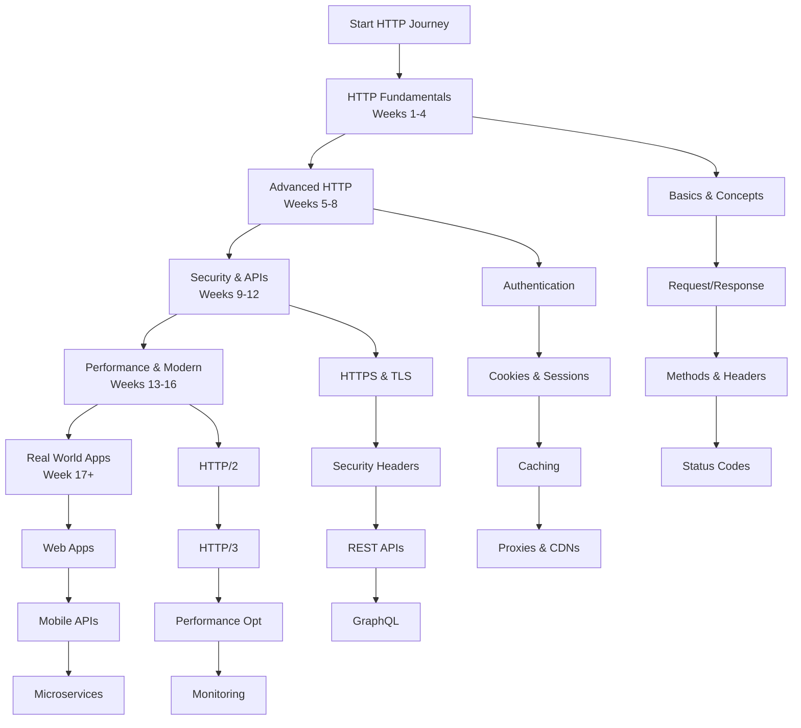

# HTTP Protocol Learning Path: A Structured Curriculum

This comprehensive roadmap provides a structured approach to mastering HTTP protocol. The curriculum is designed sequentially, with each module building upon previous knowledge to ensure a solid foundation and progressive skill development.

---

## Phase 1: HTTP Fundamentals & Basic Concepts (Weeks 1-4)

*   [**Module 1: Introduction to Web Protocols**](https://github.com/example/http-intro/#readme)
    *   HTTP Overview: History, Purpose, and Role in Web Communication
    *   Client-Server Architecture and Stateless Nature
    *   OSI Model and TCP/IP Stack - Where HTTP Fits
    *   HTTP vs HTTPS: Basic Security Concepts
    *   Tools for HTTP Inspection: Browser DevTools, curl, Postman

*   [**Module 2: HTTP Basics & URL Structure**](https://github.com/example/http-basics/#readme)
    *   URL Components: Scheme, Host, Port, Path, Query, Fragment
    *   URI vs URL vs URN Differences
    *   HTTP Message Format: Start-line, Headers, Body
    *   Character Encoding and Content Negotiation
    *   MIME Types and Content-Type Header

*   [**Module 3: HTTP Request Methods**](https://github.com/example/http-methods/#readme)
    *   **GET**: Retrieving Resources (Safe, Idempotent)
    *   **POST**: Creating Resources (Unsafe, Non-idempotent)
    *   **PUT**: Updating Resources (Unsafe, Idempotent)
    *   **DELETE**: Removing Resources (Unsafe, Idempotent)
    *   **PATCH**: Partial Updates (Unsafe, Non-idempotent)
    *   **HEAD**, **OPTIONS**, **TRACE** - Utility Methods

*   [**Module 4: HTTP Status Codes**](https://github.com/example/http-status-codes/#readme)
    *   **1xx Informational**: 100 Continue, 101 Switching Protocols
    *   **2xx Success**: 200 OK, 201 Created, 204 No Content
    *   **3xx Redirection**: 301 Moved, 302 Found, 304 Not Modified
    *   **4xx Client Errors**: 400 Bad Request, 401 Unauthorized, 403 Forbidden, 404 Not Found
    *   **5xx Server Errors**: 500 Internal Error, 502 Bad Gateway, 503 Service Unavailable

*   [**Module 5: HTTP Headers**](https://github.com/example/http-headers/#readme)
    *   **General Headers**: Date, Cache-Control, Connection
    *   **Request Headers**: User-Agent, Accept, Authorization, Cookie
    *   **Response Headers**: Server, Set-Cookie, Location, WWW-Authenticate
    *   **Entity Headers**: Content-Type, Content-Length, Content-Encoding

---

## Phase 2: Advanced HTTP Features (Weeks 5-8)

*   [**Module 6: Authentication & Authorization**](https://github.com/example/http-auth/#readme)
    *   Basic Authentication: `Authorization: Basic` Header
    *   Digest Authentication and Security Considerations
    *   Bearer Tokens and OAuth 2.0 Framework
    *   JWT (JSON Web Tokens) Structure and Usage
    *   API Keys and Custom Authentication Schemes

*   [**Module 7: Cookies & Session Management**](https://github.com/example/http-cookies/#readme)
    *   Cookie Mechanism: Set-Cookie and Cookie Headers
    *   Cookie Attributes: Domain, Path, Expires, Max-Age, Secure, HttpOnly
    *   Session Management Patterns and Security Best Practices
    *   SameSite Cookie Attribute and CSRF Protection
    *   LocalStorage vs SessionStorage vs Cookies

*   [**Module 8: Caching Mechanisms**](https://github.com/example/http-caching/#readme)
    *   Cache-Control Headers: max-age, no-cache, no-store, must-revalidate
    *   Expires Header and Date-based Caching
    *   ETag and Last-Modified for Conditional Requests
    *   Validation: If-Modified-Since, If-None-Match
    *   Cache Hierarchies: Browser, Proxy, CDN Caching

*   [**Module 9: Proxies & Intermediate Servers**](https://github.com/example/http-proxies/#readme)
    *   Forward Proxies vs Reverse Proxies
    *   Load Balancers and Health Checks
    *   CDN (Content Delivery Network) Architecture
    *   HTTP Headers for Proxying: X-Forwarded-For, Via, X-Real-IP
    *   Gateway and Tunnel Concepts

---

## Phase 3: Security & API Development (Weeks 9-12)

*   [**Module 10: HTTPS & TLS/SSL**](https://github.com/example/http-https/#readme)
    *   SSL/TLS Handshake Process and Cryptography Basics
    *   Certificate Authorities and PKI (Public Key Infrastructure)
    *   Mixed Content Issues and HSTS (HTTP Strict Transport Security)
    *   Certificate Pinning and Security Considerations
    *   TLS 1.2 vs TLS 1.3 Differences

*   [**Module 11: Security Headers & Best Practices**](https://github.com/example/http-security/#readme)
    *   **CSP** (Content Security Policy) for XSS Protection
    *   **CORS** (Cross-Origin Resource Sharing) Headers
    *   Security Headers: X-Frame-Options, X-Content-Type-Options
    *   Referrer-Policy and Feature-Policy Headers
    *   Security Vulnerability Prevention: XSS, CSRF, Clickjacking

*   [**Module 12: RESTful API Design**](https://github.com/example/http-rest/#readme)
    *   REST Principles: Resources, Representations, Statelessness
    *   Resource Naming Conventions and URL Design
    *   HATEOAS (Hypermedia as the Engine of Application State)
    *   API Versioning Strategies: URL, Headers, Media Types
    *   Richardson Maturity Model for REST APIs

*   [**Module 13: API Formats & Standards**](https://github.com/example/http-api-formats/#readme)
    *   JSON API Specification and Structure
    *   HAL (Hypertext Application Language)
    *   OpenAPI/Swagger Specification for API Documentation
    *   GraphQL over HTTP: Queries, Mutations, Subscriptions
    *   gRPC vs REST Comparison

---

## Phase 4: Performance & Modern HTTP (Weeks 13-16)

*   [**Module 14: HTTP/2 Protocol**](https://github.com/example/http2/#readme)
    *   Binary Framing Layer and Multiplexing
    *   Header Compression with HPACK
    *   Server Push Mechanism and Benefits
    *   Stream Prioritization and Flow Control
    *   Migration from HTTP/1.1 and Compatibility

*   [**Module 15: HTTP/3 & QUIC**](https://github.com/example/http3/#readme)
    *   QUIC Protocol over UDP instead of TCP
    *   Improved Connection Establishment (0-RTT, 1-RTT)
    *   Enhanced Mobility and Multiplexing
    *   Current Browser and Server Support
    *   Performance Benefits and Use Cases

*   [**Module 16: Performance Optimization**](https://github.com/example/http-performance/#readme)
    *   Critical Rendering Path Optimization
    *   Image Optimization and Lazy Loading
    *   Minification, Compression, and Bundling
    *   HTTP/2 Server Push Strategies
    *   Performance Monitoring and Metrics

*   [**Module 17: Monitoring & Debugging**](https://github.com/example/http-monitoring/#readme)
    *   HTTP Traffic Analysis with Wireshark
    *   Browser DevTools Network Panel Deep Dive
    *   Server Log Analysis and Monitoring Tools
    *   Real User Monitoring (RUM) and Synthetic Testing
    *   Error Tracking and Performance Metrics

---

## Phase 5: Real-World Applications & Advanced Topics

*   [**Module 18: Web Application Architecture**](https://github.com/example/http-webapps/#readme)
    *   Single Page Applications (SPA) HTTP Patterns
    *   Progressive Web Apps (PWA) and Service Workers
    *   Server-Side Rendering vs Client-Side Rendering
    *   Microservices Communication Patterns
    *   API Gateway and Backend-for-Frontend Patterns

*   [**Module 19: Mobile API Development**](https:///github.com/example/http-mobile/#readme)
    *   Mobile-Specific HTTP Considerations
    *   Offline-First Strategies and Synchronization
    *   Push Notifications and Background Sync
    *   Battery Efficiency and Data Usage Optimization
    *   Mobile API Security Best Practices

*   [**Module 20: WebSockets & Real-time Communication**](https://github.com/example/http-websockets/#readme)
    *   WebSocket Protocol Handshake and Frames
    *   Real-time Bidirectional Communication
    *   Server-Sent Events (SSE) for Push Notifications
    *   WebRTC and Peer-to-Peer Communication
    *   Socket.IO and Other Abstraction Libraries

*   [**Module 21: File Transfer & Streaming**](https://github.com/example/http-files/#readme)
    *   File Upload Strategies: Multipart, Base64, Chunked
    *   Range Requests and Partial Content (206)
    *   Video Streaming: Progressive vs Adaptive Bitrate
    *   Large File Download and Resume Capability
    *   Content-Disposition Headers for File Downloads

---

## Phase 6: Specialization & Advanced Implementation

*   [**Module 22: HTTP Server Implementation**](https://github.com/example/http-servers/#readme)
    *   Building a Basic HTTP Server from Scratch
    *   Request Parsing and Response Generation
    *   Connection Handling and Concurrency Models
    *   Middleware Patterns and Request Pipeline
    *   Performance Tuning and Scalability

*   [**Module 23: Load Testing & Benchmarking**](https://github.com/example/http-load-testing/#readme)
    *   Load Testing Tools: Apache Bench, wrk, k6
    *   Stress Testing and Breaking Point Analysis
    *   Performance Benchmarking Methodology
    *   Capacity Planning and Scalability Testing
    *   Real-world Load Testing Scenarios

*   [**Module 24: HTTP in Cloud Environments**](https://github.com/example/http-cloud/#readme)
    *   HTTP in Kubernetes: Ingress, Services, Load Balancing
    *   AWS API Gateway and Lambda Functions
    *   Azure API Management and Functions
    *   Google Cloud Endpoints and Cloud Functions
    *   Serverless HTTP Patterns and Considerations

*   [**Module 25: Compliance & Standards**](https://github.com/example/http-compliance/#readme)
    *   HTTP RFC Standards and Specifications
    *   Web Accessibility Guidelines (WCAG)
    *   GDPR and Privacy Considerations
    *   PCI DSS Compliance for Payment Processing
    *   Industry-specific Compliance Requirements

---

## Learning Resources

*   **Official Specifications:** [HTTP RFC 9110](https://www.rfc-editor.org/rfc/rfc9110.html)
*   **MDN Web Docs:** [HTTP MDN](https://developer.mozilla.org/en-US/docs/Web/HTTP)
*   **Tools:** curl, Postman, Wireshark, Browser DevTools
*   **Books:** "HTTP: The Definitive Guide", "High Performance Browser Networking"
*   **Practice Platforms:** Web Security Academy, HTTPbin.org

*Note: Replace `https://github.com/example/` with actual repository links for each module.*
